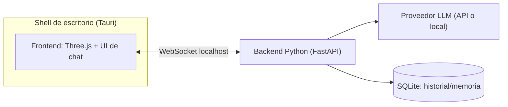

# PRD: Compañero 3D interactivo de escritorio (MVP)

> Estado: borrador v0.2 (agregado contrato HTTP de práctica) · Dueño: Steven Pautt · Fecha: 2026-10-03
> Las secciones marcadas **[DECIDIR]** son preguntas abiertas.

## 1. Visión

Una aplicación de escritorio con un personaje 3D que el usuario puede ver, mover y con el que puede conversar por chat. Toma como inspiración la experiencia del mod Verity para Minecraft, pero es independiente: no usa código, modelos ni assets del mod.

## 2. Objetivo del MVP

Validar que existe un ciclo completo y fluido: **el usuario escribe → la IA responde → el modelo 3D reacciona** (animación o expresión) en menos de 3 s en una máquina de gama media.

### Fuera de alcance (MVP)

- Voz (STT/TTS), reconocimiento de cámara o micrófono.
- Control del sistema operativo (abrir apps, leer archivos).
- Varios personajes, editor de personajes, tienda de modelos.
- Cuentas de usuario, sincronización en la nube, móvil.


## 3. Usuarios y casos de uso

- **U1**: Abro la app y veo al personaje en idle (respira y parpadea).
- **U2**: Puedo rotar y hacer zoom a la cámara y hacer clic en el personaje (reacción).
- **U3**: Le escribo en el chat y su respuesta aparece en streaming.
- **U4**: Mientras responde, el personaje cambia de animación o expresión según una emoción que devuelve la IA.
- **U5**: Al cerrar y volver a abrir la app, recuerda la conversación reciente.
- **U6**: En Ajustes elijo el proveedor del modelo de IA y su clave o URL.


## 4. Requisitos funcionales


| ID  | Requisito                                                                                         | Prioridad |
| --- | ------------------------------------------------------------------------------------------------- | --------- |
| RF1 | Renderizar un modelo 3D con animación idle                                                        | Must      |
| RF2 | Controles de cámara (orbit, zoom) con límites                                                     | Must      |
| RF3 | Panel de chat con historial y streaming de tokens                                                 | Must      |
| RF4 | El backend devuelve `{text, emotion}`, con `emotion` ∈ {neutral, happy, sad, surprised, thinking} | Must      |
| RF5 | Mapear `emotion` a una animación o expresión del modelo                                           | Must      |
| RF6 | Persistencia local del historial (SQLite)                                                         | Should    |
| RF7 | Personalidad configurable (system prompt en archivo)                                              | Should    |
| RF8 | Interacción por clic en el modelo, con reacción predefinida                                       | Could     |
| RF9 | Ventana transparente o "siempre encima" en modo mascota                                           | Could     |


## 5. Requisitos no funcionales

- **Rendimiento**: ≥ 30 FPS con el modelo en escena; RAM total < 500 MB sin contar un LLM local.
- **Latencia**: primer token en < 2 s con API remota.
- **Privacidad**: datos solo en local; claves de API guardadas en el keychain del sistema operativo o en `.env`, nunca en el repo.
- **Plataformas**: Windows 10/11 primero **[DECIDIR: ¿macOS/Linux en el MVP?]**.
- **Robustez**: si el backend cae, el frontend muestra el error y reintenta la conexión.


## 6. Arquitectura propuesta




- **Shell**: Tauri (recomendado, más liviano) o Electron **[DECIDIR]**. Tauri lanza el backend Python como *sidecar*; Electron lo haría con `child_process`.
- **Frontend**: TypeScript, Vite, Three.js. Formato de modelo **VRM** con `@pixiv/three-vrm` (expresiones y huesos estándar) o glTF/GLB **[DECIDIR]**.
- **Backend**: Python 3.11+, FastAPI y Uvicorn, con una capa `llm/` que abstrae al proveedor (OpenAI-compatible y Ollama). Empaquetado con PyInstaller para el sidecar.
- **Comunicación**: un WebSocket en `127.0.0.1:<puerto aleatorio>` con un token generado al arrancar, para que otras apps locales no puedan usar el backend.


### Contrato HTTP de práctica (v0) · vigente en Fase 1–2

Es temporal y sirve mientras aprendemos. Se reemplaza por el contrato WebSocket (v1) en la Fase 3 (T3.5).


| Ruta      | Método | Recibe (body)       | Responde                                            |
| --------- | ------ | ------------------- | --------------------------------------------------- |
| `/`       | GET    | -                   | `{"mensaje": "Hola, soy el backend del companion"}` |
| `/health` | GET    | -                   | `{"ok": true}`                                      |
| `/chat`   | POST   | `{"texto": "hola"}` | `{"respuesta": "Dijiste: hola"}`                    |


- `texto` es obligatorio y debe ser texto (lo valida el modelo `MensajeEntrada`). Si falta, FastAPI responde `422`.
- La lógica de la respuesta vive en `backend/cerebro.py` → `responder(texto)`; `main.py` solo recibe y entrega.


### Contrato de mensajes (v1) · Fase 3 en adelante

```jsonc
// cliente → servidor
{ "type": "user_message", "id": "uuid", "text": "hola" }
// servidor → cliente (streaming)
{ "type": "token", "id": "uuid", "delta": "Ho" }
{ "type": "done",  "id": "uuid", "text": "Hola!", "emotion": "happy" }
{ "type": "error", "id": "uuid", "message": "..." }
```


## 7. Estructura del repo

```
/apps/desktop     # Tauri + frontend (Three.js, UI)
/backend          # FastAPI, llm/, memory/, tests/
/assets/models    # modelos 3D con licencia verificada
/docs             # PRD.md, ADRs
AGENTS.md         # contexto para agentes de código
```


## 8. Hitos

1. **M0, esqueleto**: Tauri abre una ventana, el backend responde `/health` y el WebSocket hace eco.
2. **M1, escena 3D**: modelo cargado, idle, cámara.
3. **M2, chat + IA**: streaming real y `emotion` estructurada.
4. **M3, reacción**: mapeo de emoción a animación y persistencia en SQLite.
5. **M4, empaquetado**: instalador de Windows con el sidecar incluido.


## 9. Riesgos

- **Licencia del modelo 3D**: usar solo modelos propios, con licencia CC o de VRoid con permiso. No extraer assets del mod Verity.
- **Empaquetar Python** (tamaño y antivirus en Windows): probarlo desde M0.
- **Emoción poco fiable** si el LLM no devuelve JSON válido: usar salida estructurada con un *fallback* a `neutral`.
- **Costo de la API**: poner límites de tokens y la opción de LLM local.


## 10. Preguntas abiertas

1. ¿Tauri o Electron? (Recomiendo Tauri.)
2. ¿Qué modelo 3D usar y en qué formato (VRM o GLB)? ¿Ya tienes uno?
3. ¿El LLM va por API (cuál) o local con Ollama?
4. ¿Qué personalidad tendrá el personaje?
5. ¿Windows solamente en el MVP?

